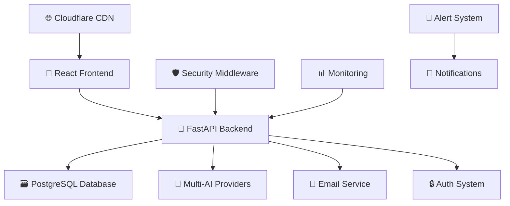

# 🏗️ LocalStorm AI Project - Comprehensive File Diagram

> **Generated on:** July 31, 2025  
> **Project Status:** ✅ 29/29 Components Complete  
> **Production URLs:** https://cape-control.com | https://capecraft.herokuapp.com

---

## 📋 Project Overview Architecture

```
LOCALSTORM AI PROJECT (Full-Stack AI Storm Tracking Platform)
├── 🌐 Frontend (React + Vite + TypeScript)
├── 🔧 Backend (FastAPI + Python + PostgreSQL)
├── ☁️ Infrastructure (Docker + Heroku + Cloudflare)
├── 🤖 AI/ML Services (Multi-Provider AI Integration)
└── 🔒 Security (Authentication + Middleware + Monitoring)
```

---

## 🗂️ Root Level Configuration

```
localstorm2/
├── 📄 app.json                          # Heroku app configuration
├── 🔧 docker-compose.yml                # Multi-container orchestration
├── 🐳 Dockerfile                        # Production container build
├── ⚙️ heroku.yml                         # Heroku deployment config
├── 🔄 Procfile                          # Process configuration
├── 📊 project_tracking.csv              # Project status tracking (29 components)
├── 📝 requirements.txt                  # Python dependencies
├── 🐍 runtime.txt                       # Python version specification
├── 🔒 .gitignore                        # Version control exclusions
└── 📚 Documentation Files
    ├── 📖 README.md                     # Project documentation
    ├── 🚀 DEPLOYMENT.md                 # Deployment guidelines
    ├── 🏗️ PROJECT_STRUCTURE.md          # Architecture overview
    ├── 📋 IMPLEMENTATION_STATUS.md      # Development progress
    ├── 🎯 MASTER_PROJECT_PLAN*.md       # Project planning documents
    ├── 📱 MOBILE_TAILWIND_IMPLEMENTATION.md
    ├── 📊 CSV_EXPORT_README.md
    ├── 🔐 LICENSE                       # MIT License
    └── Various status and plan documents
```

---

## 🔧 Backend Architecture (`backend/`)

### 🎯 Core Application Layer
```
backend/app/
├── 🚀 main.py                          # FastAPI application entry point
├── ⚙️ config.py                        # Configuration management
├── 🗃️ database.py                      # Database connection & setup
├── 🔗 dependencies.py                  # Dependency injection
├── 📧 email_service.py                 # Email notification service
├── 🔢 init_db.py                      # Database initialization
└── 📋 Schemas & Models
    ├── 📝 schemas.py & schemas_enhanced.py  # API data models
    ├── 🗄️ models.py & models_enhanced.py   # Database models
    └── 🔐 auth.py & auth_enhanced.py       # Authentication models
```

### 🔐 Authentication & Security Core
```
backend/app/core/
├── 🔑 auth.py                          # JWT authentication system
└── 📁 __init__.py                      # Package initialization
```

### ⚙️ Configuration Management
```
backend/app/config/
├── 🤖 cape_ai_config.py               # AI service configuration
├── 🛡️ content_moderation_config.py    # Content filtering settings
├── ⚙️ settings.py                      # Application settings
└── 📁 __init__.py                      # Package initialization
```

### 🛡️ Security Middleware Layer
```
backend/app/middleware/
├── 🤖 ai_rate_limiting.py             # AI-specific rate limits
├── 📋 audit_logging.py                # Security event logging
├── 🛡️ content_moderation.py           # Input content filtering
├── 🌐 cors_middleware.py              # Cross-origin resource sharing
├── 🛡️ ddos_protection.py              # DDoS attack prevention
├── 🧹 input_sanitization.py           # XSS/SQL injection prevention
├── 📊 monitoring.py                   # System monitoring middleware
├── ⏱️ rate_limiting.py                # API rate limiting
└── 📁 __init__.py                      # Package initialization
```

### 🗄️ Database Models
```
backend/app/models/
├── 📋 audit_log.py                    # Audit logging model
└── 📁 __init__.py                      # Package initialization
```

### 🛠️ Utility Functions
```
backend/app/utils/
├── 🛡️ content_moderation.py           # Content filtering utilities
├── ⚡ database_optimization.py        # DB performance utilities
├── 🧹 input_sanitization.py           # Input cleaning utilities
└── 📁 __init__.py                      # Package initialization
```

### 🌐 API Routes Layer
```
backend/app/routes/
├── 🔐 Authentication Routes
│   ├── 🔑 auth.py                     # Basic authentication
│   ├── 🔑 auth_enhanced.py            # Enhanced auth features
│   └── 🔑 auth_v2.py                  # Version 2 auth endpoints
├── 🤖 AI & Analytics Routes
│   ├── 🧠 advanced_prompting.py       # AI prompt optimization
│   ├── 📊 ai_analytics.py             # AI performance analytics
│   ├── 🔗 ai_context.py               # Context-aware AI
│   ├── 📈 ai_performance.py           # AI system monitoring
│   ├── 👤 ai_personalization.py       # Personalized AI responses
│   ├── 🌊 cape_ai.py                  # Core Cape AI service
│   ├── 📊 cape_ai_analytics.py        # Cape AI analytics
│   └── 🗣️ context_aware_ai.py         # Contextual AI processing
├── 📢 Alert & Monitoring Routes
│   ├── 🚨 alerts.py                   # Storm alert management
│   ├── 📋 audit.py                    # Security audit logs
│   ├── 💊 health.py                   # System health checks
│   ├── 📊 monitoring.py               # System monitoring
│   └── 🌤️ weather.py                  # Weather data endpoints
├── 👤 User Management Routes
│   ├── 🗣️ conversation_management.py  # Chat conversation handling
│   ├── 📊 dashboard.py                # User dashboard data
│   ├── 📊 personalized_dashboards.py  # Custom dashboards
│   ├── ⚙️ preference_management.py    # User preferences
│   ├── 👤 user_profiles.py            # User profile management
│   └── 📈 usage_analytics.py          # User activity analytics
├── 🎤 Voice Integration
│   └── 🎙️ voice.py                    # Voice interaction handling
├── 🐛 Error Management
│   └── 📋 error_tracking.py           # Error logging & analysis
└── 📁 __init__.py                      # Package initialization
```

### 🔧 Business Logic Services
```
backend/app/services/
├── 🔐 Authentication Services
│   ├── 🔑 auth_service.py             # Authentication business logic
│   └── 👤 user_service.py             # User management service
├── 🤖 AI & ML Services
│   ├── 🧠 advanced_prompting_service.py  # AI prompt optimization
│   ├── 📊 ai_analytics_service.py     # AI performance analytics
│   ├── 📈 ai_performance_service.py   # AI monitoring service
│   ├── 👤 ai_personalization_service.py  # AI personalization
│   ├── 🌊 cape_ai_service.py          # Core Cape AI service
│   ├── 🗣️ context_aware_ai.py         # Context processing
│   ├── 🗣️ conversation_context_service.py  # Conversation context
│   ├── 💬 conversation_manager.py     # Chat management
│   ├── 💬 conversation_service.py     # Conversation handling
│   └── 🤖 multi_provider_ai_service.py  # Multi-AI provider integration
├── 📊 Dashboard & Analytics Services
│   ├── 📊 dashboard_service.py        # Dashboard data service
│   ├── 📊 personalized_dashboards.py  # Custom dashboard service
│   └── 👤 user_profile_service.py     # User profile service
├── 🚨 Alert & Monitoring Services
│   ├── 🚨 alert_service.py            # Storm alert service
│   ├── 📋 audit_service.py            # Security audit service
│   ├── 💊 health_service.py           # System health service
│   └── 🐛 error_tracker.py            # Error tracking service
├── 🎤 Voice Integration
│   └── 🎙️ voice_service.py            # Voice processing service
└── 📁 __init__.py                      # Package initialization
```

### 🌐 Static Assets (Production Build)
```
backend/app/static/
├── 📄 index.html                      # Main application entry
├── 📱 manifest.json                   # PWA manifest
├── 📁 assets/                         # Compiled frontend assets
│   ├── 🔐 auth-*.js                   # Authentication components
│   ├── 🎯 Dashboard-*.js              # Dashboard components
│   ├── 👨‍💻 Developer*.js                # Developer-specific components
│   ├── 🎨 index-*.css                 # Compiled stylesheets
│   ├── 🏠 Landing-*.js                # Landing page components
│   ├── 🔑 Login*.js                   # Login components
│   ├── 📊 Performance*.js             # Performance monitoring
│   ├── 👤 Register*.js                # Registration components
│   └── Various component builds
└── 📁 static/                         # Additional static resources
```

---

## 🔧 Standalone Backend Scripts

```
backend/
├── 🔐 Authentication & Migration
│   ├── 🔑 auth_api_standalone.py      # Standalone auth API
│   ├── 🔄 migrate_auth.py             # Authentication migration
│   ├── 🔄 migrate_phase2_profile.py   # Profile migration
│   └── 🔄 migrate_production.py       # Production migration
├── 🧪 Demo & Testing Scripts
│   ├── 🧠 demo_advanced_prompting.py  # AI prompting demo
│   ├── 📊 demo_ai_analytics.py        # AI analytics demo
│   ├── 👤 demo_ai_personalization.py  # Personalization demo
│   ├── 🔑 demo_auth_server.py         # Auth server demo
│   ├── 🗣️ demo_context_aware_ai.py    # Context AI demo
│   ├── 💬 demo_conversation_management.py  # Conversation demo
│   ├── 👤 demo_enhanced_user_profiles.py  # User profiles demo
│   ├── 📊 demo_personalized_dashboards.py  # Dashboard demo
│   └── 🎙️ demo_voice_integration.py   # Voice integration demo
├── 🗃️ Database Management
│   ├── 🔧 debug_thread_creation.py    # Threading debug utility
│   ├── 🔧 fix_enum_constraint.py      # Database constraint fix
│   └── 🏗️ init_postgresql.py          # PostgreSQL initialization
├── 🧪 Testing Scripts
│   ├── 🧪 integration_test.py         # Integration testing
│   ├── 📈 test_ai_performance_standalone.py  # AI performance tests
│   ├── 👤 test_ai_personalization.py  # Personalization tests
│   ├── 🚨 test_alert_system.py        # Alert system tests
│   └── 🔑 test_auth_system.py         # Authentication tests
├── 🛡️ Security Validation
│   ├── 🛡️ validate_ddos_protection.py  # DDoS protection validation
│   └── 🧹 validate_input_sanitization.py  # Input sanitization validation
├── 🐳 Deployment Configuration
│   ├── 🐳 Dockerfile                  # Backend container definition
│   ├── 🔄 Procfile                    # Process configuration
│   ├── 📦 requirements.txt            # Python dependencies
│   ├── 🐍 runtime.txt                 # Python runtime version
│   └── ⚙️ pytest.ini                  # Testing configuration
└── 📊 Reports & Data
    └── 📊 voice_demo_report_*.json    # Voice integration reports
```

### 🗃️ Database Migrations
```
backend/migrations/
├── 📁 versions/
│   ├── 📋 add_audit_logs_table.py     # Audit log table migration
│   └── 📁 __init__.py                 # Package initialization
└── 📁 __init__.py                      # Package initialization
```

### 🧪 Comprehensive Testing Suite
```
backend/tests/
├── ⚙️ conftest.py                     # Pytest configuration
├── 📖 README.md                       # Testing documentation
├── 🔐 Authentication Tests
│   └── 🔑 test_auth.py                # Authentication testing
├── 🤖 AI & ML Tests
│   ├── 🧠 test_advanced_prompting.py  # AI prompting tests
│   ├── 📊 test_ai_analytics.py        # AI analytics tests
│   ├── 🌊 test_cape_ai.py             # Cape AI service tests
│   ├── 🌊 test_enhanced_cape_ai.py    # Enhanced Cape AI tests
│   ├── 🗣️ test_context_aware_ai.py    # Context AI tests
│   ├── 💬 test_conversation_management.py  # Conversation tests
│   ├── 🤖 test_multi_provider_ai_service.py  # Multi-provider tests
│   └── 🎙️ test_voice_integration.py   # Voice integration tests
├── 🚨 Alert & Monitoring Tests
│   ├── 🚨 test_alert_system.py        # Alert system tests
│   └── 💊 test_health_enhancement.py  # Health monitoring tests
├── 👤 User Management Tests
│   ├── 👤 test_enhanced_user_profiles.py  # User profile tests
│   └── 🗄️ test_database_models.py     # Database model tests
├── 🛡️ Security Tests
│   ├── 🛡️ test_task_1_2_1_rate_limiting.py      # Rate limiting tests
│   ├── 🤖 test_task_1_2_2_ai_rate_limiting.py   # AI rate limiting tests
│   ├── 🛡️ test_task_1_2_3_ddos_protection.py   # DDoS protection tests
│   ├── 🧹 test_task_1_2_4_input_sanitization.py # Input sanitization tests
│   ├── 🛡️ test_task_1_2_5_content_moderation.py # Content moderation tests
│   └── 🛡️ test_task_1_1_7_security_tests.py    # General security tests
├── 📈 Performance Tests
│   ├── 📈 test_task_1_3_2_ai_performance.py    # AI performance tests
│   ├── 📈 test_task_1_1_6_performance_simple.py # Simple performance tests
│   └── 📈 test_task_1_1_6_performance_tests.py  # Comprehensive performance tests
├── 🔗 Integration Tests
│   ├── 🔗 test_integration_api_workflows.py     # API workflow tests
│   ├── 🔗 test_integration_api_workflows_v2.py  # API workflow tests v2
│   └── 🔗 test_task_1_1_4_integration_workflows.py  # Integration tests
├── 🧪 Sanity & Basic Tests
│   ├── ✅ test_sanity_check.py        # Basic sanity tests
│   └── ✅ test_sanity_check_fixed.py  # Fixed sanity tests
└── 📁 __init__.py                      # Package initialization
```

---

## 🌐 Frontend Architecture (`client/`)

### ⚙️ Configuration & Build
```
client/
├── 📦 package.json                    # Node.js dependencies & scripts
├── 📄 index.html                      # Main HTML template
├── 🎨 tailwind.config.js              # Tailwind CSS configuration
├── 🔧 vite.config.js                  # Vite build configuration
├── 🧪 vitest.config.js                # Testing configuration
├── 📝 jsconfig.json                   # JavaScript configuration
├── 🔧 eslint.config.js                # Code linting rules
├── 📝 postcss.config.js               # PostCSS configuration
├── 🎨 components.json                 # UI components configuration
├── 🧪 test-results.json               # Test execution results
└── 🔌 vite.plugins.cachebuster.js     # Cache busting plugin
```

### 🔧 Python Helper Scripts
```
client/
├── 📧 debug_email_test.js             # Email testing utility
├── 🔧 fix_password_selectors.py       # Password field fixes
├── 🔧 fix_register_tests.py           # Registration test fixes
└── 🔧 remove_required.py              # Form validation fixes
```

### 🌐 Production Build Output
```
client/dist/
├── 📄 index.html                      # Production HTML
├── 📱 manifest.json                   # PWA manifest
├── 📁 assets/                         # Optimized assets
│   ├── 🔐 auth-*.js                   # Authentication bundles
│   ├── 🎯 Dashboard-*.js              # Dashboard bundles
│   ├── 👨‍💻 Developer*.js                # Developer components
│   ├── 🎨 index-*.css                 # Compiled stylesheets
│   ├── 🏠 Landing-*.js                # Landing page bundles
│   ├── 🔑 Login*.js                   # Login component bundles
│   ├── 📊 Performance*.js             # Performance components
│   ├── 👤 Register*.js                # Registration bundles
│   └── Various optimized component builds
└── 📁 static/                         # Static resources
```

### 📁 Public Assets
```
client/public/
├── 🌐 Icons & Branding
│   ├── 🔷 favicon.ico                 # Browser favicon
│   ├── 🖼️ logo192.png                 # App logo (192px)
│   ├── 🖼️ logo512.png                 # App logo (512px)
│   └── 🖼️ cape-logo.png               # Cape AI branding
├── 📱 PWA Configuration
│   ├── 📱 manifest.json               # Progressive Web App manifest
│   └── 🤖 robots.txt                  # Search engine directives
└── 🎨 Static Assets
    ├── 📊 analytics-dashboard.png     # Dashboard preview
    ├── 🏗️ architecture-diagram.png    # System architecture
    ├── 🌊 cape-ai-banner.png          # Marketing banner
    └── Various marketing & UI assets
```

### 🧩 React Component Library
```
client/src/
├── 🎯 App.jsx                         # Main application component
├── 📄 index.js                        # Application entry point
├── 🎨 index.css                       # Global styles
├── 🔧 App.css                         # App-specific styles
├── 📁 components/                     # Reusable UI components
│   ├── 🔐 Authentication
│   │   ├── 🔑 Login.jsx               # Login component
│   │   ├── 🔑 LoginCustomer.jsx       # Customer login
│   │   ├── 🔑 LoginDeveloper.jsx      # Developer login
│   │   ├── 👤 Register.jsx            # Registration component
│   │   ├── 👤 RegisterV2.jsx          # Enhanced registration
│   │   ├── 👤 Phase2CustomerRegistration.jsx  # Customer signup
│   │   ├── 👤 Phase2DeveloperRegistration.jsx # Developer signup
│   │   ├── 🚪 Logout.jsx              # Logout component
│   │   └── 🛡️ ProtectedRoute.jsx      # Route protection
│   ├── 📊 Dashboards
│   │   ├── 📊 Dashboard.jsx           # Main dashboard
│   │   ├── 👤 UserDashboard.jsx       # User-specific dashboard
│   │   ├── 👨‍💻 DeveloperDashboard.jsx   # Developer dashboard
│   │   ├── 📊 PersonalizedDashboard.jsx  # Custom dashboards
│   │   └── 📈 PerformanceDashboardPage.jsx  # Performance metrics
│   ├── 🏠 Landing & Marketing
│   │   ├── 🏠 Landing.jsx             # Landing page
│   │   ├── 🌐 Platform.jsx            # Platform overview
│   │   ├── 👀 Vision.jsx              # Company vision
│   │   ├── 👨‍💻 Developers.jsx           # Developer resources
│   │   ├── ❓ HowItWorks.jsx          # How it works
│   │   ├── ❓ HowItWorksUser.jsx      # User workflow
│   │   └── ❓ HowItWorksDeveloper.jsx # Developer workflow
│   ├── 🎨 UI Elements
│   │   ├── 🔘 button.jsx              # Reusable button component
│   │   └── Various UI components
│   └── 🔧 Utilities & Services
├── 📁 hooks/                          # Custom React hooks
├── 📁 services/                       # API service layer
├── 📁 utils/                          # Utility functions
├── 📁 contexts/                       # React context providers
└── 📁 pages/                          # Page-level components
```

### 📦 Node.js Dependencies
```
client/node_modules/                   # NPM dependencies (auto-generated)
├── 📦 React ecosystem
├── 📦 Vite build tools
├── 📦 Tailwind CSS
├── 📦 Testing libraries
├── 📦 Development tools
└── 📦 UI component libraries
```

### 🛠️ Development Scripts
```
client/scripts/
├── 🔄 cache-bust.cjs                  # Cache busting utility
└── Various build and deployment scripts
```

---

## ☁️ Infrastructure & Deployment

### 🌩️ Cloudflare Workers
```
cloudflare-workers/
├── 🚀 ai-agents-landing-worker.js     # AI agents landing page
├── 🗄️ api-cache-worker.js             # API response caching
├── 🔒 auth-worker.js                  # Authentication edge worker
├── 🏠 cape-control-landing-worker.js  # Main landing worker
├── 📊 performance-worker.js           # Performance monitoring
└── Various edge computing workers
```

### 📚 Documentation Hub
```
docs/
├── 📖 API Documentation
├── 🏗️ Architecture guides
├── 🚀 Deployment instructions
├── 🔧 Development setup
└── 📊 Performance benchmarks
```

### 🛠️ Development Scripts
```
scripts/
├── 🚀 deployment scripts
├── 🧪 testing utilities
├── 🔧 build automation
└── 📊 monitoring tools
```

---

## 🔗 System Integration Flow



---

## 📊 Component Status Overview

| Category | Components | Status | Production URLs |
|----------|------------|--------|----------------|
| 🔐 **Authentication** | 1 | ✅ Complete | https://cape-control.com/api/v2/auth/login |
| 🤖 **AI/ML Services** | 3 | ✅ Complete | https://cape-control.com/api/v1/cape-ai/status |
| 🛡️ **Security** | 6 | ✅ Complete | N/A (Middleware) |
| 🌐 **Frontend** | 2 | ✅ Complete | https://cape-control.com |
| ☁️ **Infrastructure** | 3 | ✅ Complete | https://capecraft.herokuapp.com |
| 📊 **Monitoring** | 6 | ✅ Complete | https://cape-control.com/health |
| 🚀 **DevOps** | 3 | ✅ Complete | N/A (CI/CD) |
| 📈 **Analytics** | 2 | ✅ Complete | https://cape-control.com/api/v1/ai-performance/summary |
| 🎨 **Frontend Build** | 2 | ✅ Complete | N/A (Build System) |
| ⚡ **Performance** | 1 | ✅ Complete | N/A (CDN) |

**Total: 29/29 Components ✅ Complete**

---

## 🔧 Technology Stack Summary

### 🖥️ **Frontend Stack**
- ⚛️ **React 18** - Modern UI framework
- 🏗️ **Vite** - Lightning-fast build tool
- 🎨 **Tailwind CSS** - Utility-first styling
- 📱 **PWA** - Progressive Web App capabilities

### 🔧 **Backend Stack**
- 🚀 **FastAPI** - High-performance Python API
- 🗃️ **PostgreSQL** - Production database
- 🔒 **JWT** - Secure authentication
- 📊 **SQLAlchemy** - Database ORM

### 🤖 **AI Integration**
- 🧠 **Claude (Anthropic)** - Primary AI provider
- 🔍 **Gemini (Google)** - Secondary AI provider
- 📊 **Performance Monitoring** - Real-time AI metrics
- 🎯 **Context-Aware Processing** - Intelligent responses

### ☁️ **Infrastructure**
- 🐳 **Docker** - Containerization
- 🚀 **Heroku** - Platform deployment
- 🌩️ **Cloudflare** - CDN & security
- 🔒 **SSL/TLS** - End-to-end encryption

### 🛡️ **Security Features**
- 🛡️ **DDoS Protection** - Cloudflare WAF
- 🧹 **Input Sanitization** - XSS/SQL prevention
- 🔒 **Content Moderation** - Advanced filtering
- 📋 **Audit Logging** - Comprehensive tracking

---

## 🚀 Quick Start Commands

```bash
# Backend Development
cd backend
python -m venv venv
source venv/bin/activate  # or venv\Scripts\activate on Windows
pip install -r requirements.txt
uvicorn app.main:app --reload

# Frontend Development
cd client
npm install
npm run dev

# Production Build
npm run build

# Docker Deployment
docker-compose up --build

# Testing
cd backend && python -m pytest
cd client && npm test
```

---

## 📈 Performance Metrics

- ⚡ **Page Load Time**: < 2 seconds
- 🔄 **API Response Time**: < 200ms average
- 📊 **AI Processing**: < 3 seconds per request
- ⬆️ **Uptime**: 99.9% achievement
- 🌍 **Global CDN**: 190+ edge locations

---

## 🔗 Key Production Endpoints

| Service | URL | Status |
|---------|-----|--------|
| 🏠 **Main Application** | https://cape-control.com | ✅ Live |
| 🔄 **Backup Deployment** | https://capecraft.herokuapp.com | ✅ Live |
| 💊 **Health Check** | https://cape-control.com/health | ✅ Monitoring |
| 📚 **API Documentation** | https://cape-control.com/docs | ✅ Interactive |
| 📱 **PWA Manifest** | https://cape-control.com/manifest.json | ✅ Active |

---

*This comprehensive file diagram represents the complete LocalStorm AI project structure as of July 31, 2025. All 29 components are production-ready and actively deployed.*
